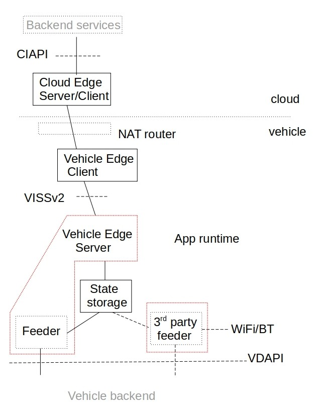

**(C) 2022 Geotab Inc** 

# Vehicle Edge Client (VEC)

The VEC can be used in a tech stack configuration as shown in the figure below
 

The VEC client is a client that if deployed in-vehicle will read the file vecRequests.json containing a list of VISSv2 requests that it will issue to the in-vehicle VISSv2 server,
and then start to receive the responses, which will then be "pushed" to the Cloud Edge Server/Client (CESC) over HTTP/HTTPS. 
The payload of the POST requests have the following JSON based format: 
{"vin":"XXX","data":YYY} 
where XXX is the vehicle identification that the VISSv2 server responds to on a request for the VSS path "Vehicle.VehicleIdentification.VIN", 
and YYY is one of the four possible data objects that is specified in the VISSv2 specification. 

If the client is started without any command argument the following is shown: 
<pre>
usage: print [-h|--help] [--logfile] [--loglevel
             (trace|debug|info|warn|error|fatal|panic)] -u|--cecUrl "<value>"

             VEC client

Arguments:

  -h  --help      Print help information
      --logfile   outputs to logfile in ./logs folder
      --loglevel  changes log output level. Default: info
  -u  --cecUrl    IP/URL to CEC cloud end point (REQUIRED)
</pre>

Usage of the VEC client leads to that the vehicle-to-cloud communication does not conform to the VISSv2 specified communication. 
However, in cases where the vehicle blocks all attempts for an in-vehicle server to be connected to by an external client, 
usage of the VEC client, together with a CEC client in the cloud, enables a communication of vehicle data from the vehicle to the cloud. 
How the configuration file that sets which vehicle signals that are to be communicated is out of scope, and needs to be solved by the vehicle OEM. 
The in-vehicle VISSv2 server can still be used by a client deployed in a mobile device, if the mobile device is a host in the vehicle subnet. 
Also a client deployed as an app in e. g. an infotainment based app ecosystem could also connect to the VISSv2 server. 
The file containing the requests that the VEC issues to the server is currently restricted to subscribe requests, read or update requests are not supported.
